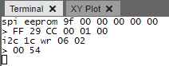

<!-- Please do not change this logo with link -->

<a target="_blank" href="https://www.microchip.com/" id="top-of-page">
   <picture>
      <source media="(prefers-color-scheme: light)" srcset="images/mchp_logo_light.png" width="350">
      <source media="(prefers-color-scheme: dark)" srcset="images/mchp_logo_dark.png" width="350">
      
   </picture>
</a>

# USB to SPI/I2C Converter with AVR64DU32

The AVR&reg; DU family of microcontrollers (MCU) contain a Full Speed (12 Mbps) USB Transceiver for developing low cost USB devices. In this example, the AVR64DU32 MCU bridges a host computer with low-level SPI and I2C communication with the USB Communication Device Class (CDC). 

## Related Documentation

## Software Used

- [MPLAB&reg; X IDE v6.20 or newer](#)
- [MPLAB XC8 v2.46 or newer compiler](#)
- MPLAB Code Configurator

## Hardware Used

- [AVR64DU32 Curiosity Nano Evaluation Kit (???)](#)
- [Curiosity Nano Explorer Board (???)](#)
     - The Explorer board is not required, as SPI and I2C can be performed on other platforms, but the Explorer board comes with a wide variety of serial sensors to interface with. 

## Setup

- Disconnect the EEPROM Hold Jumper (Jumper 13)

## Operation

### LED Status

LED0 on the Curiosity Nano is used to indicate the status of the USB Communication. If the LED is ON, that means the application's USB state machine is in the `USB_READY` state. If the LED is OFF, that indicates the application's state machine is in `USB_DISCONNECTED` or `USB_ERROR`.

### Serial Commands

When a USB is attached to the AVR DU, the device enumerates a CDC Class USB device, which allows a serial terminal to exchange data with the MCU. The AVR DU functions as a SPI and I2C Host that performs the communication specified by the command sent by the user.

**Note**: Commands are not case sensitive, but all numbers sent and received are in hexadecimal format.  

  

#### SPI

SPI commands take the format of the following:

- spi eeprom \<bytes to send\>  
- spi dac \<bytes to send\>

For instance, to read the identification register of the 25CSM04 EEPROM, send the following the command: 

> spi eeprom 9F 00 00 00 00 00 

The response is the following:

> FF 29 CC 00 01 00

The first byte (FF) is a don't care as the EEPROM has it's SDO (MISO) line set to High-Z during this time.

#### I2C

I2C commands take the format of:

- i2c \<address\> r \<number of bytes to read>
- i2c \<address\> w \<bytes to write>
- i2c \<address\> wr \<register address byte> \<bytes to read\>

The Write Read (wr) operation first addresses the I2C device in write mode, writes 1 byte (register address byte), restarts the bus, re-addresses the device in read mode, then reads (bytes to read) amount of data. 

For instance, to get the manufacturer's ID from the MCP9808:
> i2c 1c wr 06 02

This command will return the following bytes:
> 00 54

## Summary

<!-- Summarize what the example has shown -->
