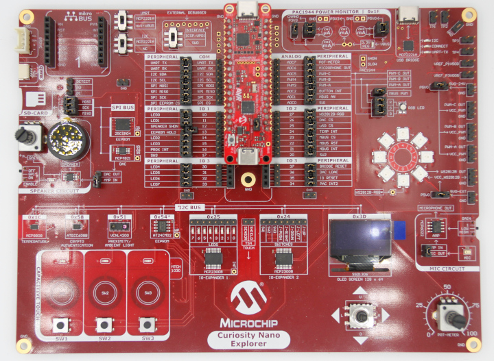

<!-- Please do not change this logo with link -->

<a target="_blank" href="https://www.microchip.com/" id="top-of-page">
   <picture>
      <source media="(prefers-color-scheme: light)" srcset="images/mchp_logo_light.png" width="350">
      <source media="(prefers-color-scheme: dark)" srcset="images/mchp_logo_dark.png" width="350">
      
   </picture>
</a>

# USB to SPI and I2C Converter With AVR64DU32

The AVR&reg; DU family of microcontrollers (MCU) contains a Full Speed (12 Mbps) USB Transceiver for developing low-cost USB devices. In this example, the AVR64DU32 MCU bridges a host computer with low-level SPI and I2C communication with the USB Communication Device Class (CDC). 

## Related Documentation
- [AVR DU Family](https://www.microchip.com/en-us/products/microcontrollers-and-microprocessors/8-bit-mcus/avr-mcus/avr-du?utm_source=GitHub&utm_medium=TextLink&utm_campaign=MCU8_AVR-DU&utm_content=avr64du32-serial-bridge-mplab-mcc-github&utm_bu=MCU08)  

## Software Used

- [MPLAB&reg; X IDE v6.20 or newer](https://www.microchip.com/en-us/tools-resources/develop/mplab-x-ide?utm_source=GitHub&utm_medium=TextLink&utm_campaign=MCU8_AVR-DU&utm_content=avr64du32-serial-bridge-mplab-mcc-github&utm_bu=MCU08)
- [MPLAB XC8 v2.46 or newer compiler](https://www.microchip.com/en-us/tools-resources/develop/mplab-xc-compilers?utm_source=GitHub&utm_medium=TextLink&utm_campaign=MCU8_AVR-DU&utm_content=avr64du32-serial-bridge-mplab-mcc-github&utm_bu=MCU08)
- [MPLAB Code Configurator](https://www.microchip.com/en-us/tools-resources/configure/mplab-code-configurator?utm_source=GitHub&utm_medium=TextLink&utm_campaign=MCU8_AVR-DU&utm_content=avr64du32-serial-bridge-mplab-mcc-github&utm_bu=MCU08)

## Hardware Used

- [AVR64DU32 Curiosity Nano Evaluation Kit (EV59F82A)](https://www.microchip.com/en-us/development-tool/EV59F82A?utm_source=GitHub&utm_medium=TextLink&utm_campaign=MCU8_AVR-DU&utm_content=avr64du32-serial-bridge-mplab-mcc-github&utm_bu=MCU08)
- [Curiosity Nano Explorer Board (EV58G97A)](https://www.microchip.com/en-us/development-tool/EV58G97A?utm_source=GitHub&utm_medium=TextLink&utm_campaign=MCU8_AVR-DU&utm_content=avr64du32-serial-bridge-mplab-mcc-github&utm_bu=MCU08)

**Note**: The Explorer board is not required, as SPI and I2C can be performed on other platforms, but the Explorer board comes with a wide variety of serial sensors to interface with. 

## Setup

**Notes**: 

1. For communication with the EEPROM, disconnect jumper 13 (EEPROM HOLD), as the Curiosity Nano LED conflicts with this signal.

2. To communicate with the memory card (*optional*), bridge the PF0 contacts (J107) located on the back of the Curiosity Nano and cut strap J109. However, this prevents the use of the 32 kHz crystal. More information about disconnecting the crystal can be found [in the user guide](https://onlinedocs.microchip.com/oxy/GUID-6E827030-13B3-4E71-AB50-A32EBF5333B9-en-US-1/GUID-A9D2F79F-11A0-43BB-BAB1-0A87B0D59138.html#GUID-A9D2F79F-11A0-43BB-BAB1-0A87B0D59138). 

## Operation

### LED Status

LED0 on the Curiosity Nano is used to indicate the status of the USB Communication. If the LED is ON, that means the application's USB state machine is in the `USB_READY` state. If the LED is OFF, that indicates the application's state machine is in `USB_DISCONNECTED` or `USB_ERROR`.

### Serial Commands

When a USB is attached to the AVR DU, the device enumerates a CDC Class USB device, which allows a serial terminal to exchange data with the MCU. The serial parameters are not critical as the serial commands do not leave the microcontroller.  

The AVR DU functions as a SPI and I2C Host that performs the communication specified by the command sent by the user.

**Note**: Commands are not case sensitive, but all numbers sent and received are in hexadecimal format.  

  

#### SPI

- SPI Clock Frequency: 1.25 MHz
- Mode: 0 ()

SPI commands have the following format:

- spi eeprom \<bytes to send\>  
- spi dac \<bytes to send\>
- spi usd \<bytes to send\>

**Note**: See the setup section for more information about using the `usd` parameter.

For instance, to read the identification register of the 25CSM04 EEPROM, send the following command: 

> spi eeprom 9F 00 00 00 00 00 

The response is the following:

> FF 29 CC 00 01 00

The first byte (0xFF) is a don't care value as the EEPROM has it's SDO (MISO) line set to High-Z during this time.

#### I2C

- Address Length: 7 bits
- Clock Frequency: 100 kHz

I2C commands have the following format:

- i2c \<address\> r \<number of bytes to read>
- i2c \<address\> w \<bytes to write>
- i2c \<address\> wr \<register address byte> \<bytes to read\>

The Write/Read (wr) operation first addresses the I2C device in Write mode, writes one byte (register address byte), restarts the bus, re-addresses the device in Read mode, then reads (bytes to read) the amount of data. 

For instance, to get the manufacturer's ID from the MCP9808:
> i2c 1c wr 06 02

This command will return the following bytes:
> 00 54

## Summary

This example has demonstrated the AVR DU as a USB to I2C and SPI converter.